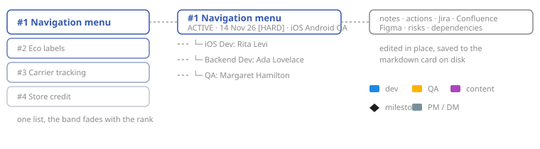

# GanttBit

A local, dependency-free control center for a delivery manager: a markdown
knowledge vault on disk, rendered as an interactive Gantt chart with per
project notes, actions, links, attachments and an editable card schema.

Nothing leaves your machine, nothing is installed: it is Python 3.11+ standard
library, two stylesheets and two scripts.



## Quick start

```bash
python3 dashboard.py --vault sample-vault --port 8099
```

Open <http://localhost:8099>. That runs against `sample-vault/`, a fictional
organisation used both as a demo and as the test fixture.

To use your own vault, point the settings at it and just run:

```bash
python3 dashboard.py
```

| Flag | Meaning |
|---|---|
| `--settings PATH` | settings file (default `settings.local.toml`, else `settings.toml`) |
| `--vault PATH` | vault root, keeping the folder layout from the settings |
| `--projects PATH` | directory of project cards (overrides `--vault`) |
| `--host`, `--port` | bind address and port (default `127.0.0.1:8080`) |
| `--token` | shared secret demanded off loopback (generated when omitted) |

The server binds to loopback by default. Bind it anywhere else and it demands
an access token on every request. One is generated at startup and printed
inside the URL to open:

```
GanttBit listening on http://127.0.0.1:8099?k=8mQ2vN7pLxKd4RtYwZ
Reachable from other machines: that link carries the access token.
```

Opening that link sets an HttpOnly cookie and redirects to the clean URL. Set
your own with `--token` or `[server] token` in `settings.toml`. It is a shared
secret over plain HTTP, so it keeps strangers on the same Wi-Fi out. On a
hostile network it is no substitute for TLS.

## The chart

The toolbar carries a search, a depth, a zoom and a window. The depth levels
are **Compact**, **Projects**, **Stakeholders** and **All details**: absolute
levels rather than toggles, so each one does the same thing whatever is folded
right now. **Compact** is one line per project, the drag handle, the number,
the name and its span bar, which is a third shorter than a normal row. The
zoom is **Day**, **Week** or **Month**; a column is always a working day, and
the zoom decides how wide it is drawn. The window is what the chart is drawn
through: from today, the last 30 days, this year, all dates, or
from a date you pick. The choice travels in the URL (`?from=…`) and is
remembered per browser, and so is everything you collapsed, opened and scrolled
to: a save reloads the page and puts you back where you were, including the
chart's own horizontal position.

**Settings**, the button in the footer, holds four groups: the theme (System,
Light, Dark, or one of twenty-three palettes borrowed from well-known editors
behind **More…**), the priority band, the chart's weekday letters, and whether
saving and discarding ask first. They are per-browser preferences.

Bars are dragged and resized in the chart: grab one in the middle to move it,
or either edge to change where it starts or ends. Whole working days, applied
to the dates the card holds, so a bar whose start is hidden by "show from
today" still moves by exactly what you dragged.

A **milestone** is a dated mark on the project's own lane, drawn as the
diamond this interface uses for nothing else. Click an empty day in a lane to
propose one there, or add it from the panel; clicking the diamond opens the
same overlay, with a delete that asks first. Hovering it tells you the date and
what happens on it.

A project is finished by dragging it into **DONE** at the bottom of the chart,
abandoned by dragging it into **DROPPED**, and brought back by dragging it into
the list above them, which is also what the status select in its panel does.
Neither group appears in the aggregated action list, so finished work stops
asking for attention. `priority` is the project's position in that one list, so
the number in the card is the number on the screen.

A note that belongs to no project yet goes in the **Inbox**, the first card of
the aggregated list: write it there and it lands in `inbox.md`, a card like any
other on disk, which the chart and the project count leave out. **New project**
in the header asks for a name and nothing else, and comes back with the new
card's panel open.

Every project carries a coloured band down its left edge, and the colour is its
rank: full accent at the top of the list, fading to a near-grey at the bottom.
With a dozen projects two neighbours barely differ, because the band is meant
to be read as a ramp down the list rather than as a project's identity, and the
number beside it is what names a position. The two ends are worked out against
whichever theme is on, so the band holds the same contrast on all of them.
Colour, intensity, fade and tint are in **Settings**, with four presets.

## On a phone

Below 900px the chart stops being the interface. A bar at the bottom carries
four surfaces over the same cards, **Projects**, **Chart**, **Notes** and
**More**, and the default is a list of project cards: the number and the name,
the status, the deadline as time remaining, a sparkline of the span with today
and the milestones on it, the people as initials, and how many notes are
waiting. Tapping one opens the project full screen with its notes first;
tapping any value opens its editor. Projects move with **Move up / Move down /
Move to**, because HTML5 drag and drop does not exist on iOS.

The detail panel becomes a single column and the page never scrolls sideways.
The chart still does, because a timeline is wide by nature, inside its own
container. Two controls are hidden on touch because they need a pointing
device: resizing the label column, and dragging rows to reorder them.

## Two views over the vault

The chart is one reading of the cards; **Hierarchy** is the other, and the
header switches between them. *Structure* is the vault as a tree: every
project, then every value the card holds under the names the card uses (the
keys this codebase knows nothing about included, and the `## Notes` body),
every branch foldable. It reads at the chart's four levels, *Compact*,
*Projects*, *Stakeholders* and *All details*, and at three amounts of detail:
*All*, *No keys*, and *Relevant*, which drops the keys, the ids and the empty
values and prints the timeline as one line per row. Double-click a value to
edit it where it stands; the change goes to the card at that path, validated
where the schema knows the field. *Markdown* is every card concatenated in the same order,
editable in one go: a block whose
`- id:` is unknown creates a card, and a card whose block is not in the text is
left alone. Nothing is ever deleted from that screen. The same document
downloads as `vault-YYYY-MM.md`, which is the monthly snapshot.

## Configuration

Everything an organisation changes lives in [`settings.toml`](settings.toml):
squads and the people in them, roles, Jira/Confluence/Figma base URLs,
wording, vault paths. Adding a team member or a project never requires touching
Python. The priority band is not there: it is a per-browser preference, set in
**Settings** beside the theme.

Put the keys that differ in a `settings.local.toml` next to it (git-ignored):
it is layered over `settings.toml`, so it only carries what you change, and
your real names stay out of the repository.

```toml
[app]
owner = "Your name"

[vault]
root = "/path/to/your/vault"
```

## The vault

```
<vault>/
├── 02-projects/active/<project-id>.md              one card per project
└── 02-projects/active/attachments/<project-id>/    its files, any type
```

A card is a markdown outline: the title is the project name, every field is
a `- key: value` item, and free text lives under `## Notes`. Everything in
[`ganttbit/schema.py`](ganttbit/schema.py) is editable from the UI; unknown
keys are preserved untouched, so you can keep your own fields in a card.

````markdown
# Navigation menu — second level
- id: project-1-navigation-menu
- status: active                     (done and dropped give it its own group)
- priority: 1                        (position in the list, set by drag & drop)
- intro:
  ```md
  Multi-line values are fenced, so nothing has to be escaped.
  ```
- dates
  - deadline_text: 2026-11-14
  - deadline_type: hard
- tech_footprint
  - platforms
    - iOS
    - Android

## Notes

Free markdown, kept verbatim.
````

A vault written before 0.1.0 is converted once with
`./dashboard.py --migrate-vault`, which leaves a `.bak` beside every file it
rewrites and refuses to convert the same card twice.

A project owns its bars. `timeline.start` plus either `timeline.end` or
`timeline.days` (working days) draws the project bar, which exists even with no
tasks, and each row under `timeline.tasks` draws one person's bar:

````markdown
- timeline
  - start: 2026-08-24
  - end: 2026-11-20
  - tasks
    - task-1
      - who: Ada Lovelace
      - start: 2026-08-24
      - days: 34
      - flags
        - crit
      - note: Menu API v2
````

`who` is matched against the roster in `[[squads]]` by name, which gives the
row its role and colour. A task falling outside the span its project declares
is marked rather than hidden. A delivery plan written as a mermaid `gantt`
block, as earlier versions used, is moved into the cards once with
`./dashboard.py --import-plan`, which reports every row it could not place and
leaves the file untouched.

## What a card becomes


Every request parses the vault again, so a card you changed in your editor
shows up on the next reload and there is no index to fall out of step. An edit
goes the other way as one action against one card: the schema refuses an
invalid value with a 400 before anything reaches the disk, and the save writes
a sibling temp file and renames it. A key this codebase has never heard of
makes the whole round trip untouched.

The same diagram is a page you can explore at
[dataflow.html](https://stangoldbear.github.io/ganttbit/dataflow.html),
with the outward path, the way back and the round trip traced one at a time.
Its source is [`docs/dataflow.json`](docs/dataflow.json).

## Architecture

Layers, each with one reason to change; dependencies point inward and only
`repository` touches the filesystem.

| Module | Responsibility |
|---|---|
| `settings` | `settings.toml` parsing, fails fast; presentation constants |
| `cardmd` | the markdown card format ⇄ Python data |
| `repository` | the vault on disk, atomic writes |
| `domain` | dates, the priority ramp, roles, gantt parsing, timeline (pure, clock injected) |
| `schema` | the card schema, declared once |
| `markup` / `gantt` / `view` | HTML rendering |
| `api` | mutations, behind a routing table |
| `server` | HTTP, static assets, JSON |

Two rules worth keeping:

- Data never reaches the browser inside executable code. Values travel as
  escaped text or escaped `data-*` attributes; every file under `static/` is a
  real file that Python never generates.
- Layout metrics live in one place. `settings.py` emits them as CSS custom
  properties; the stylesheet and the resize script read them, they never
  restate them.

## Tests

```bash
python3 -m unittest test_ganttbit -v
```

122 tests, standard library only. The sample vault is the fixture: it contains
a blocked project, a malformed card, a project with no timeline task, notes
with quotes and newlines, deliberately awkward names and past/future tasks.

## License

MIT. See [LICENSE](LICENSE).
